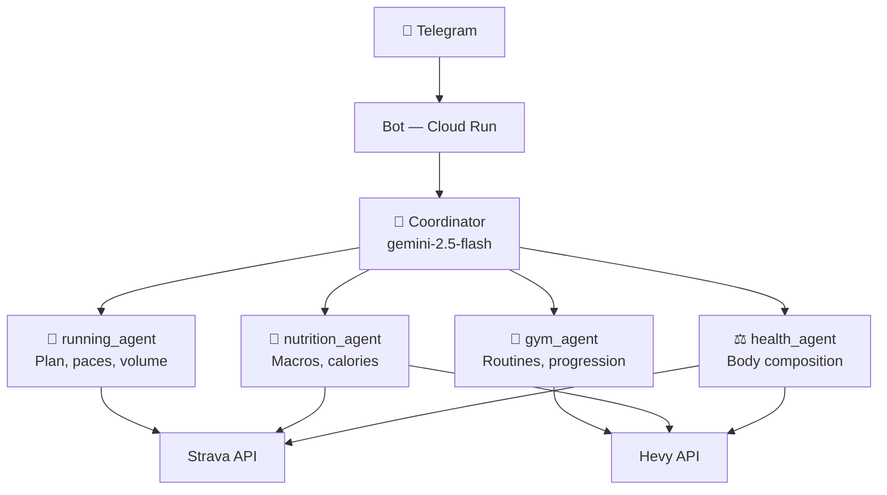
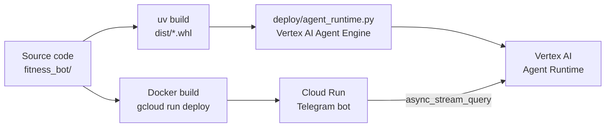

# A Personal Fitness Coach with Google ADK and Vertex AI

> "How many calories should I eat today given I ran 15 km this morning and I have gym in the afternoon?" — the question that made me build this.

I built a Telegram bot that acts as a personal fitness coach. Not a list of generic tips — an agent that queries my real training data and responds with context: my Strava activities, my Hevy routines, my body composition history.

## The Problem

I had fitness data scattered across three apps. Strava tracked my runs, Hevy my gym sessions, and I kept nutrition in notes. None of them talked to each other, and adjusting macros for a hard training day meant opening all three and doing the math by hand.

I wanted a single entry point for questions like:
- "How much should I eat today?" (accounting for this morning's run)
- "What's my squat progression over the last 8 weeks?"
- "Modify Tuesday's routine for a deload"

## The Multi-Agent Architecture

The system uses a coordinator-subagent pattern. A coordinator agent receives each message and delegates to the right specialist based on topic. There are four sub-agents, each with its own tools and context:



The coordinator has no tools of its own — it only knows the user context (training plan, goals, calorie deficit rules) and decides which sub-agent to delegate to. Each sub-agent only has access to the tools it needs.

## The Stack

**Google ADK (Agent Development Kit)** is the framework that ties everything together. Each agent is an `LlmAgent` with its own system instruction, tools, and model. The coordinator declares sub-agents explicitly:

```python
coordinator = LlmAgent(
    name="coordinator",
    model="gemini-2.5-flash",
    instruction=load_prompt("coordinator"),
    sub_agents=[running_agent, gym_agent, nutrition_agent, health_agent],
)
```

**Vertex AI Agent Runtime** hosts the coordinator and sub-agents in Google Cloud. The bot communicates with the runtime via `async_stream_query`, which delivers partial responses — the user sees text appear in real time instead of waiting for the model to finish.

**Strava API** requires OAuth 2.0. I implemented token auto-refresh: if less than 5 minutes of validity remain, the tool refreshes the token before the API call and persists the new values back to `.env`. The bot never expires silently.

**Hevy API** uses an API key and is more straightforward. The `gym_agent` can both read and write routines — if I ask it to modify the volume on a session, it makes the change directly in Hevy.

**Cloud Run** runs the bot in webhook mode in production. Locally it runs in polling mode. The same codebase supports both depending on environment variables.

## The Deployment Pipeline

The deploy involves two independent systems that need to be synchronized:



First, the coordinator and sub-agents are deployed to Vertex AI — the result is an `AGENT_RUNTIME_RESOURCE_NAME`. Then the Telegram bot is deployed to Cloud Run with that identifier as an environment variable. The two systems are independent; updating one doesn't require redeploying the other.

## Design Decisions

**Single owner.** The bot uses `OWNER_CHAT_ID` to ignore messages from any other chat. No multi-tenancy, no user management, no profile database. This radically simplified the design — user context lives directly in the coordinator's prompt.

**Shared prompts.** The `nutrition_agent` and `health_agent` share the same calorie deficit rules. Rather than duplicating them, I use an `{{include:_calorie_adjustment.md}}` mechanism in the prompts. One source of truth, two agents that consume it.

**In-memory sessions.** Vertex AI maintains conversation history per session. The bot stores a `user_id → session_id` mapping in memory — if it restarts, the mapping is lost, but the bot reuses the existing Vertex AI session without losing the history.

## What I'd Do Differently

**Persist the session mapping.** A bot restart can cause conversation discontinuities if Vertex AI already has an active session. A simple JSON file or Redis would solve this with minimal effort.

**Separate agent instructions from personal context.** Right now the coordinator has my 8-week training plan hardcoded in the prompt. A cleaner design would separate the agent's logic from the user's profile and load the latter from a database.

**Add observability.** I know the bot works because I use it daily, but I have no latency metrics or traces of which sub-agent gets called most. Cloud Trace would solve this naturally given it's already running on Google Cloud.

---

It's a personal system — the goal was to solve my own problem, not build a product. It turned out to be the most useful thing I've built.
