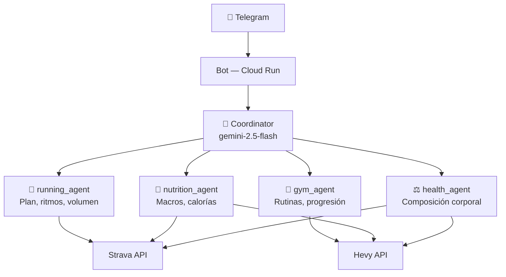
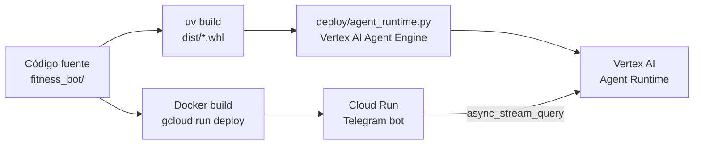

# Un Coach de Fitness Personal con Google ADK y Vertex AI

> "¿Cuántas calorías debería comer hoy dado que corrí 15 km esta mañana y tengo gym por la tarde?" — la pregunta que hizo que construyera esto.

Construí un bot de Telegram que actúa como coach personal de fitness. No una lista de consejos genéricos — un agente que consulta mis datos reales de entrenamiento y me responde con contexto: mis actividades de Strava, mis rutinas de Hevy, mi historial de composición corporal.

## El Problema

Tenía datos de fitness dispersos en tres aplicaciones. Strava registraba mis carreras, Hevy mis rutinas de gimnasio, y mi nutrición la llevaba en notas. Ninguna de las tres hablaba con las otras, y ajustar macros para un día de entrenamiento intenso requería abrir las tres apps y hacer los cálculos a mano.

Quería un punto de entrada único para preguntas como:
- "¿Cuánto debería comer hoy?" (considerando mi carrera de esta mañana)
- "¿Cuál es mi progreso en sentadilla en las últimas 8 semanas?"
- "Modifica mi rutina del martes para hacer deload"

## La Arquitectura Multi-Agente

El sistema usa un patrón de coordinador-subagentes. Un agente coordinador recibe cada mensaje y lo delega al especialista correcto según el tema. Hay cuatro subagentes, cada uno con sus propias herramientas y contexto:



El coordinador no tiene herramientas propias — solo conoce el contexto del usuario (plan de entrenamiento, metas, reglas de déficit calórico) y decide a qué subagente delegar. Cada subagente tiene acceso solo a las herramientas que necesita.

## El Stack

**Google ADK (Agent Development Kit)** es el framework que une todo. Cada agente es un `LlmAgent` con su instrucción de sistema, sus herramientas y su modelo. El coordinador declara los subagentes explícitamente:

```python
coordinator = LlmAgent(
    name="coordinator",
    model="gemini-2.5-flash",
    instruction=load_prompt("coordinator"),
    sub_agents=[running_agent, gym_agent, nutrition_agent, health_agent],
)
```

**Vertex AI Agent Runtime** hospeda el coordinador y los subagentes en Google Cloud. El bot se comunica con el runtime a través de `async_stream_query`, que entrega respuestas parciales — el usuario ve texto aparecer en tiempo real en lugar de esperar a que el modelo termine.

**Strava API** requiere OAuth 2.0. Implementé auto-refresh del token: si quedan menos de 5 minutos de validez, la herramienta renueva el token antes de la llamada y persiste los nuevos valores en `.env`. El bot nunca expira en silencio.

**Hevy API** usa API key y es más directa. El `gym_agent` puede leer y también escribir rutinas — si le pido que modifique el volumen de una sesión, hace el cambio directamente en Hevy.

**Cloud Run** ejecuta el bot en modo webhook en producción. En local corre en polling. La misma base de código soporta ambos modos según las variables de entorno.

## El Pipeline de Despliegue

El deploy involucra dos sistemas independientes que hay que sincronizar:



Primero se despliega el coordinador y los subagentes en Vertex AI — el resultado es un `AGENT_RUNTIME_RESOURCE_NAME`. Luego se despliega el bot de Telegram en Cloud Run con ese identificador en las variables de entorno. Los dos sistemas son independientes; actualizar uno no requiere redesplegar el otro.

## Decisiones de Diseño

**Un solo usuario.** El bot usa `OWNER_CHAT_ID` para ignorar mensajes de cualquier otro chat. Sin multi-tenancy, sin gestión de usuarios, sin base de datos de perfiles. Esto simplificó radicalmente el diseño — el contexto del usuario vive directamente en el prompt del coordinador.

**Prompts compartidos.** El `nutrition_agent` y el `health_agent` comparten las mismas reglas de déficit calórico. En lugar de duplicarlas, uso un mecanismo de `{{include:_calorie_adjustment.md}}` en los prompts. Una sola fuente de verdad, dos agentes que la usan.

**Sesiones en memoria.** Vertex AI mantiene el historial de conversación por sesión. El bot almacena un mapeo `user_id → session_id` en memoria — si se reinicia, el mapeo se pierde pero el bot reusa la sesión existente en Vertex AI sin perder el historial.

## Lo que Haría Diferente

**Persistir el mapeo de sesiones.** Un reinicio del bot puede causar discontinuidades en la conversación si Vertex AI ya tiene una sesión activa. Un archivo JSON o Redis lo resuelve con poco esfuerzo.

**Separar instrucciones del contexto personal.** Ahora el coordinador tiene mi plan de entrenamiento de 8 semanas hardcodeado en el prompt. Un diseño más limpio separaría la lógica del agente del perfil del usuario y cargaría este último desde una base de datos.

**Añadir observabilidad.** Sé que el bot funciona porque lo uso a diario, pero no tengo métricas de latencia ni trazas de qué subagente se invoca más. Cloud Trace lo resolvería de forma natural dado que ya corre en Google Cloud.

---

Es un sistema personal — el objetivo era resolver mi propio problema, no construir un producto. Resultó ser el proyecto más útil que he construido.
